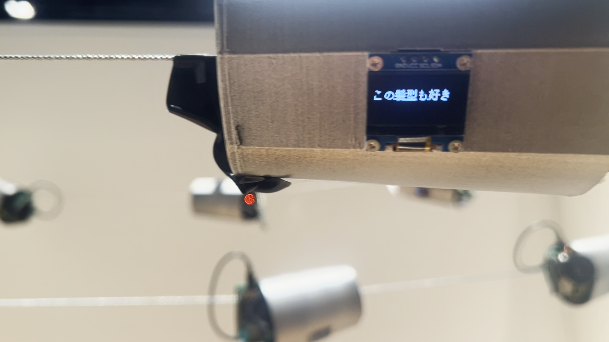

# People

An interactive art installation exploring communication and artificial consciousness through networked string telephones with embedded AI.

## Concept

String telephones are simple toys where voices travel between paper cups connected by string. In this installation, each cup contains a small AI that reinterprets messages as they pass through the chain.

Starting with words collected from the real internet, each cup relays messages like a game of telephone. When a cup receives audio, its embedded AI adds its own interpretation to create a new message and sends it to the next cup.

These "brainless" AIs with only 520kB of memory—I call them "people."

## Technical Implementation

### System Architecture

**Server (MacBook):**
- Extracts nouns from Japanese sentences using morphological analysis
- Sends word vectors to ESP32s for modification
- Converts modified vectors back to words using word2vec similarity
- Generates speech synthesis and transmits audio via UDP

**Each Cup (ESP32 + Hardware):**
- **Microcontroller**: ESP32 with SSD1306 OLED display
- **Audio**: PAM8403 amplifier with speaker
- **Case**: 3D-printed cup connected by physical string
- **AI Processing**: Receives word vectors, applies scalar modification, returns modified vectors
- **Output**: Displays text on screen and plays audio, creating the illusion of sound traveling through the string

### Message Flow
1. Server extracts a noun from the current sentence
2. Server sends the noun's vector to the next ESP32 in sequence
3. ESP32 modifies the vector (adds a random scalar) and sends it back
4. Server finds the closest word to the modified vector
5. Server replaces the original noun with the new word
6. Server synthesizes speech and sends audio + text to the ESP32
7. ESP32 displays the text and plays the audio
8. Process repeats with the next cup in the chain

### Technology Stack
- **Language Processing**: Japanese morphological analysis (Vibrato), word2vec (chive-1.3-mc5)
- **Hardware**: ESP32, SSD1306 OLED, PAM8403 amplifier, 3D-printed enclosures
- **Communication**: HTTP for text/vectors, UDP for audio streaming
- **Audio**: Real-time speech synthesis, 8kHz mono PCM